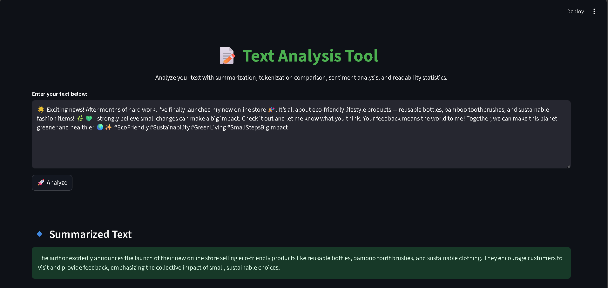
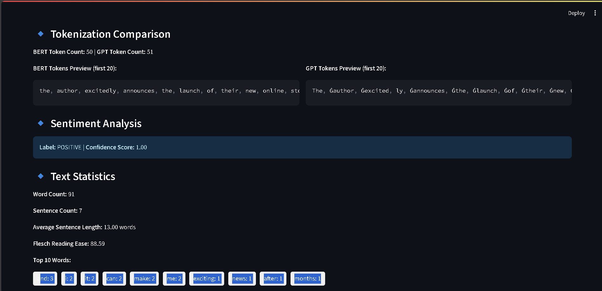

# Project Documentation:

This project is about Text Analysis using Gemini API, Transformers & Sentiment Analysis using HF Models.
I have created helper functions to keep the code reusable and also handled errors + rate limiting.

### 1. API Usage Patterns:
This project uses the Google Gemini API for text summarization. The following steps are followed for API usage:
- API key is stored securely in a .env file.
- The dotenv library is used to load environment variables.
- google.generativeai is configured with the API key.
- The summarize_text function handles text summarization.
- Proper error handling is included.

### 2. Requirements:
Install project dependencies using:
pip install -r requirements.txt

requirements.txt includes:
- google-generativeai
- python-dotenv
- transformers
- nltk
- streamlit
- pytest
- torch

### 3. How to Run:

* First, create a virtual environment and install dependencies:
pip install -r requirements.txt

* Run the main file with:
streamlit run main.py

### 4. Example Input:

Inside the data/sample_texts/ folder, I kept some sample text which you can use.

For example:
Artificial Intelligence (AI) is a field of computer science...

### 5. Error Handling + Rate Limiting:

* If API fails (like network issue), error is logged and program does not crash.
* If rate limit is hit, it waits and retries.

#### 6. Helper Functions:

* I created llm_helpers.py file in utils/ to keep API calling code reusable.
This way, I don’t repeat code in main.py.

### How it looks like:

